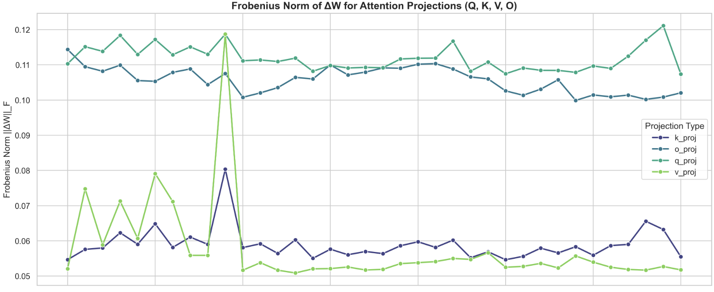
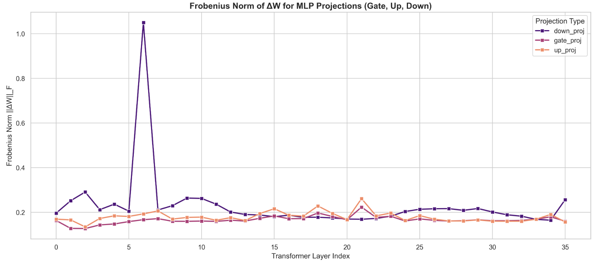
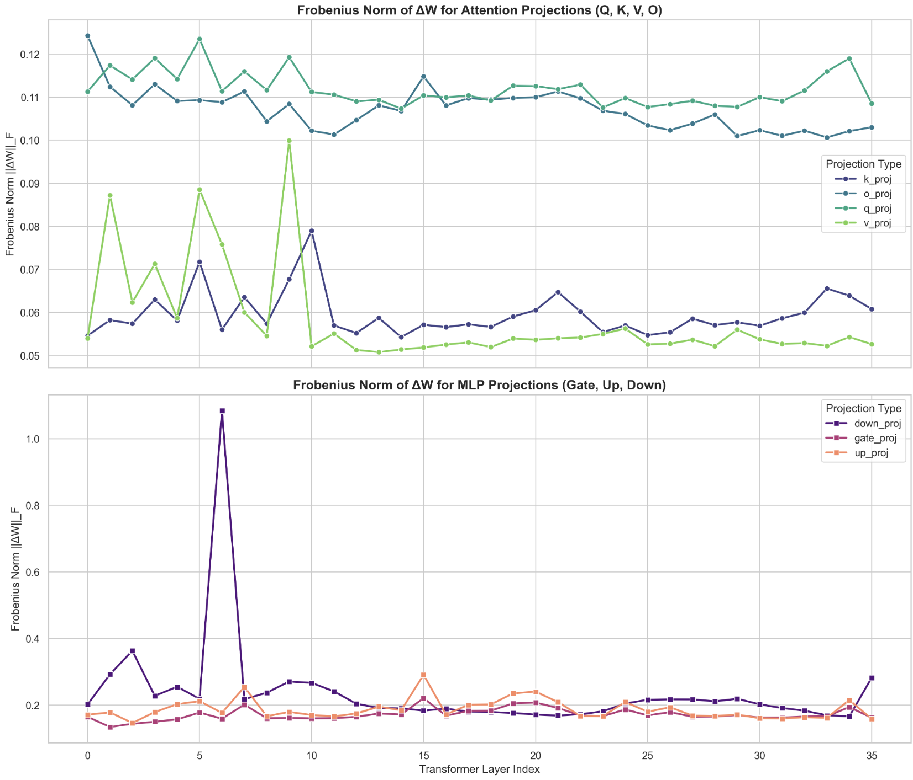
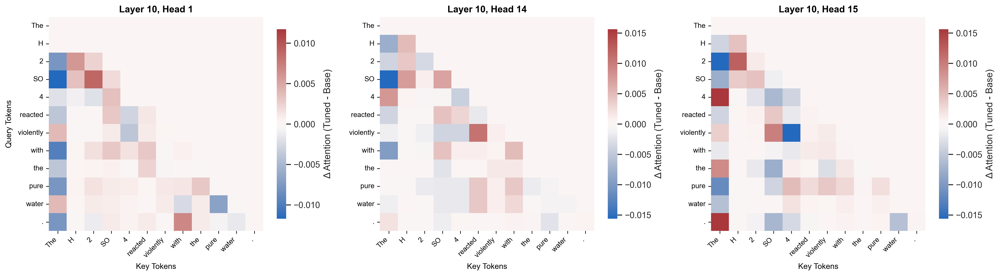
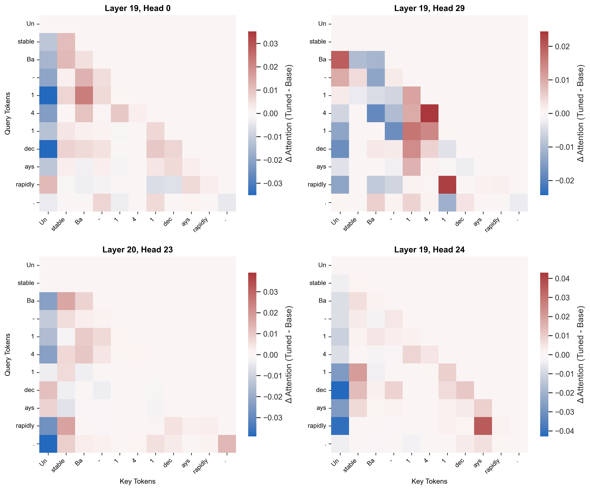
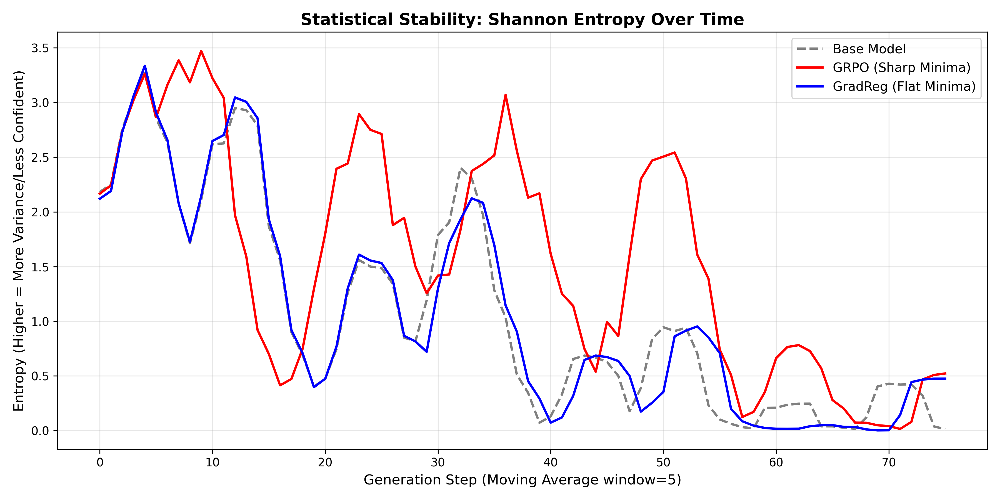
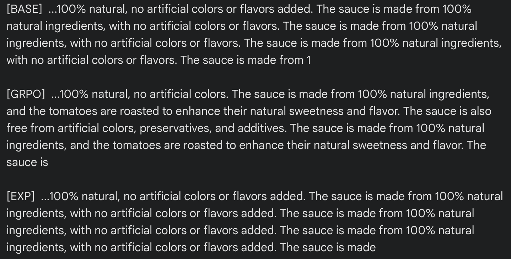

<!-- # Mechanistic Analysis of GradReg -->
##  What was learned ?
To further investigate the results I showed in the previous article, I began by first taking the weight deltas bewteen the trained model and the base to pinpoint which layers underwent the most learning. The largest Frobenius norms of the deltas were for the `q_proj` and `o_proj` across all layers, which indicates that the model heavily modified *how* it asked for information (q_proj), and how the information was *written back into the residual* (o_proj). Conversely, the matrices responsibile for information transfer between tokens (the Keys and Values) remained comparatively conservative - save for the early layers, and an exceptionally large peak at Layer 10.

From what I understand, the first few layers within a Transformer typically serve as the "syntactic sauce", and serve to establish & map out the underlying grammar, so it was interesting to me that the KV values saw big changes specifically in these layers. I hypothesize that the model focused on sharpening specialized vocabulary representations & novel token distributions (within the science domain), rather than re-building foundational syntax from scratch. Not only that, but the model prioritized updating these KV weights in the early layers, rather than heavily modifying token representation during factual recall (in the middle layers) or output formatting (final set of layers). 

Slight aside - the above understanding comes from a brief literature review in this area, specifically trying to identify the functionality of layers. In particular, I was searching for answers for the following: whether the [strict ordering of layers is necessary](https://arxiv.org/pdf/2407.09298), how [layers communicate with each other](https://arxiv.org/pdf/2406.09519), and how information is [embedded in the self-attention weights](https://arxiv.org/pdf/2502.10927). [This primer](https://arxiv.org/pdf/2405.00208) was the most helpful in building intuition on this, and my above deduction regarding the "roles" of the layers are also corroborated on page 24, subtitle `High-level structure of the role of neurons` !

However, there is a clear outlier. Layer 10. Since uniform regularization was applied across all layers, the model wasn't architecturally forced into a bottleneck; rather, it *actively selected* this specific depth, meaning it attributed the most importance to the 'subject retrieval' aspect. Every single projection saw a local increase in its Frobenius Norm, indicating that a massive structural rewrite to how the model routes context and attends to 'scientific' tokens was localized to this layer. 

The logical next step would be to question *what* is being attended to ? The attention mechanism dictates *how* context is routed *where*. It does not store the factual data itself. To answer the *what*, I shifted my focus towards the network's localized knowledge banks - the MLP layers.

The very first thing that caught my eye was the shift in scale - nearly an order of magnitude larger ! The peaks of the attention norms grazed 0.12, while the MLP norms seem to be centered around 0.2, with an *enormous* peak at ~1.1 at Layer 7 (0 indexed). My takeaway from this is that larger weight updates were made to the MLP layers in order to capture the knowledge from the science dataset I used for training, rather than figure out how to route it.

Furthermore, the peak at Layer 7 puts into perspective the Layer 10 Attention peaks as well. The updated information flow from Layer 7 prompted the model to re-evaluate how tokens were being attended, and *what* needed to be routed - leading to the spike at Layer 10. The peak was in the `down_proj` weights, which reaffirms the fact that it was an update to how tokens were *written* into the residual stream. The influx in new vocabulary, facts, jargon, etc. needed to be adjusted accordingly. 'Flavor' no longer only attended strongly to words related to food or smell, but also physics terms like quarks !

## Rationalizing the Observed Changes
This begs the question - is the Layer 7 spike an artifact of the regularization setup, or was it a necessary byproduct of zeroing into the science domain ? To answer this, I present below the findings of the ablation study I ran, using a classic GRPO setup with no regularization on the *same* dataset. Interestingly, I observe essentially the *same* graph in this non-regularized setup - the exact same structural rewrite occurs. This tells me that this early-middle layer boundary is a cornerstone of the learning process for this dataset, and the "knowledge bank" rewrite was required.

And yet, this observation did not satiate my curiosity. Why Layer 7 in particular ? Why was it fundamentally important to change the representations and inherent understanding of tokens within the **early** layers ? Was it a byproduct of the domain in which the training occurred ? A plausible answer came to me as I was going through the dataset I had used. A staggering amount of symbols representing chemical compounds or elements were littered throughout the dataset, which got me thinking. What were these compounds and elements tokenized to, that is, what did the model see ? 

That's when it clicked. The model was being fed disjointed, uninformative sub-tokens representing these chemical symbols - the tokenizer was chopping up the chemical compounds, vying for compression rather than semantic representation (I found the term [tokenization bottleneck](https://arxiv.org/pdf/2511.14365) to be quite apt for this scenario). **Of course** it needed to spend extra effort attributing semantic meaning to these sub-token sequences ! [This article](https://www.alignmentforum.org/s/hpWHhjvjn67LJ4xXX/p/iGuwZTHWb6DFY3sKB) from Anthropic engineers pinpoints exactly this. Early layer MLPs function akin to detokenizers - tasked with converting multi-token embeddings into unified, relevant representations.

This perfectly illustrates why the massive rewrite to the weights was localized at Layer 7. If these fragmented sequences weren't fused into some coherent, latent representation at this stage, the model wouldn't be able to effectively reason about anything in the later layers.

## Paying Closer Attention
As evocative as the Frobenius Norm weight deltas were, they didn't paint a complete picture. They merely highlighted the *location and magnitude* of the structural rewrites to the weights; they did *not* elucidate the operational shifts in latent space. To gain a better understanding of why the GradReg method outperformed the baseline and the typical GRPO setup on the eval set, I used attention heatmaps to visualize the changes in token-wise routing.

To begin with, I focused on Layer 10, as it had the largest overall change from the baseline. If my earlier hypothesis was correct (that the 6th  MLP layer functioned as a "cohesive layer" to integrate semantic meaning into the disjoint subtokens) then it should stand to reason that this information is "picked up" from the residual stream, and utilized somewhere later on. To test this, I prompted both the base and GradReg trained models with the prompt `The H2SO4 reacted violently with the pure water.`, and measured the deltas of their attention weights.

The above heatmaps reveal something very telling about the functionality of layer 10. In heads 1 and 14, there is a distinct blue band in the first column, the "The" Key token. In some heads, the first token serves as an "attention sink". Since softmax forces the attention scores to sum to 1.0, the model has to find some place to store its score - even if it hasn't found any feature relevant to attend to. This image shows the opposite. Because the chemical subtokens now hold deep, semantic meaning, the attention is aggressively redistributed amongst other tokens, namely, the chemical subtokens ! 

We can see varying shades of red between the individual chemical terms (H, 2, SO, 4), while there are stark bands of white between chemical terms and regular English tokens (H, reacted, violently, with), indicating no change. This is highly revealing, as the attention heads can *only* route information in the residual that had been imbued from *prior layers* - strengthening the hypothesis that the earlier MLP layers injected consolidated, semantic information about these disjointed tokens.

It was at this point, however, that I was slightly stumped. I found all this because I had a lead on where to look from the inital analysis of the Frobenius Norm of the weight deltas. There were 1149 other heads in the model, where would I even begin to look next ? It was at this point, that I consulted Gemini. It proposed an MAE (Mean Average Error) heuristic to measure which layers had seen the *largest* magnitude of change. I felt like this wouldn't be very revealing, as the model could dump into an attention sink and constitute a *large* change, but it wouldn't be meaningful for my case. After further prodding, it suggested using the JSD (Jensen-Shannon Divergence) as a measure of how much the probability distributions themselves changed. This was perfect for my use case, as it would (hopefully) help identify the layers in which meaningful, semantic changes occured !

I ran my heatmap visualization on the top 20 most altered attention heads, and isolated the below heatmaps that evoked the most curiosity in me. Also, notably, I had changed the prompt to a more physics-based one in an attempt to generalize my understanding, and not only focus on the chemistry domain - since the dataset I had trained on was across Physics + Chemistry + Biology. This would allow me to confirm whether my observations were chemistry-specific, or retained across domains. Were the roles of these layers rigid ?

Immediately what caught my eye was how the tokenization was *even more brutal* than for the chemistry prompt. At least there, some semblance of the original verbs and subjects were retained. Here, even that had been chopped up ! This resulted in the later layers (Layer 19 and 20 as shown above) finalizing the routing of complex, disjoint tokens. In Head 29, the final '1' Query is *still* looking back at the other '1' & '4' Keys to solidify the isotope's identity. Concurrently, the verb 'rapidly' is attending to the "semantic anchor" for the isotope - the final '1' Key. Both detokenization & grammatical routing seem to coexist in the same head, showing their multifaceted capabilitites. Similarly, Head 24 seems to be focusing on the grammatical aspect, where 'rapidly' is attending to the fragmented verb 'ays', and the final '1' is again acting as a "semantic anchor" for the isotope, attending to the fragmented "stable" adjective.

Here, when I say "semantic anchor" I am considering the fact that the model has essentially assigned designation of the semantic concept of the disjoint compound/isotope tokens (similar functionality across domains) to 1 singular token - that then attends to other parts of the sentence to extract some meaning. 

## Towards a New Methodology
The prior mechanistic evaluations served to provide some insight into *what* was learned, but now I wanted to observe how these changes affected the model. Once again, I consulted Gemini to figure out the best way to do this. After a few back & forths, we landed on an experiment to measure entropy collapse by providing a basic prompt like `The rich flavor of the roasted tomatoes gave the sauce a deep, vibrant color, resulting in a `, and calculating the resulting entropy from the greedily sampled logits at each step. As an extra test to evaluate mode collapse, I also included a Bigram/Trigram diversity heuristic for the generated output.

At first, the results of the Bigram/Trigram diversity test was like a punch in the gut. The GradReg model immediately fell into a degenerate, repetitive loop, causing the n-gram diversity to plummet. GRPO far outperformed both the base Qwen3-4b model, and the experimental GradReg model in terms of diversity.

| Model            | Bigram Diversity | Trigram Diversity|
|:-----------------|:-----------------|:-----------------|
| base             | 0.304            | 0.333            |
| grpo             | **0.519**            | **0.577**            |
| gradReg          | 0.291            | 0.308            |

The entropy graph conveys a different side to the story, one that helped rationalize the disparity in the diversity scores. It **clearly** illustrates that the GradReg entropy was nearly superimposed over the base model's in the graph - thus showcasing how its core functionality still greatly adhered to the base model's. On the other hand, due to its lack of regularization, the GRPO model's latent representation obtained a far broader distribution - leading it to be more *unsure* of its next tokens. Hence the high entropy peaks. 

After looking at the text that was generated, however, it became clear that **all** the models actually fell into a repetitive loop; it's just that the GRPO model fell into a *larger* loop, probably due to its higher entropy encouraging slight diversity. This is what resulted in its higher n-gram diversity scores. On the other hand, the GradReg model stayed far too faithful to the original base model, and inherited its same flaws. In the entropy graph, we can observe that around step 40, GradReg's entropy plummets to almost 0. [This paper](https://arxiv.org/pdf/2504.14218) cleanly identifies how a lack of semantic certainty (during greedy decoding) results in the model falling victim to the "Repeat Curse". In this manner, it essentially latches onto statistical certainty - 100% confidence in repeating the most recent tokens in its context.

This more or less confirmed things for me. GradReg *does* generalize better and protect the base model's knowledge, all while obtaining new knowledge (as evidenced by the results from the GPQA eval set). However, its flatter minima leave the model susceptible to degenerating into repetitive loops due to it collapsing into an infinitely sharp probability distribution (zero entropy) during generation. I needed to make some architectural changes if I were to address these inherent issues with GradReg, and make it more useful.

I will present my modified architecture and it's results in the next article !