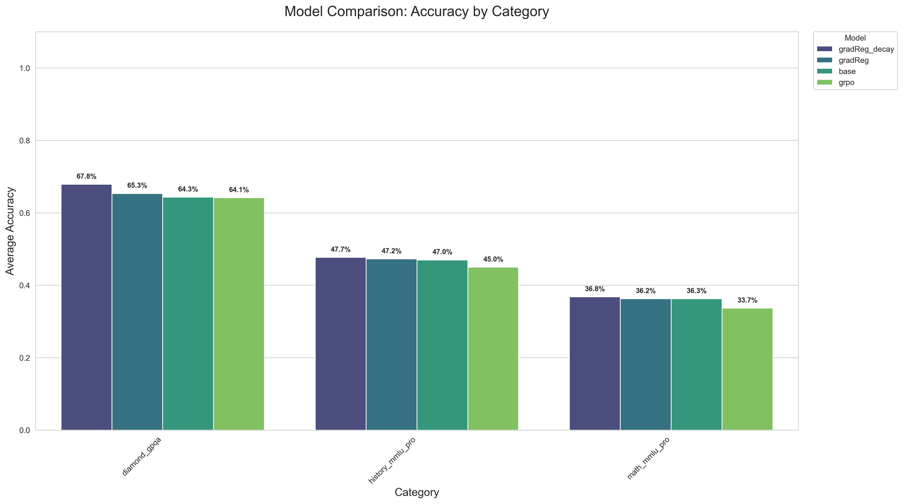
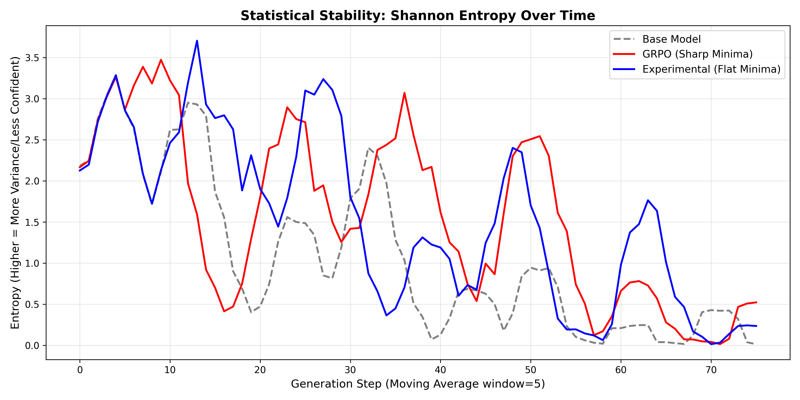
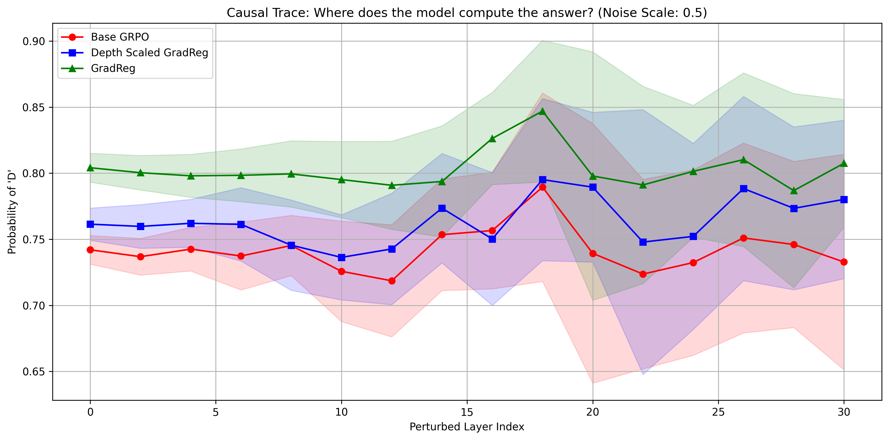

## Design Choices
The results derived within the previous article opened my eyes to some of the major issues that plagued this Gradient Regularization based RL regime. In this article, I hope to go through some of the architectural changes I made to directly address some of these issues. My core takeaway was the fact that different layers learn different representations of the provided input - which meant that it was not strictly necessary to regularize each layer equally. 

The inherent goal with Gradient Regularization is to promote convergence to parameter regions that are both robust and generalizable - thus flattening the minima in the loss landscape. Since the bulk of semantic routing and factual recall occurs within the middle-late layers, it appeared to me that I was needlessly restricting the flow of gradients into the inital set of layers within the model. It would also appear that by applying such an aggressive regularization constant throughout the entire network, I was effectively lobotomizing the model and making it more susceptible to repetitive loops.

To combat this, I tackled the problem with an asymmetric depth scaled approach to regularization. The early layers were completely free of the regularizer - allowing the rich semantic meanings between disjoint tokens (taking the example of chemical compounds from the previous article) to form. The middle layers slowly scaled up the strength of the regularization, until it maxed out at a strength of 1.0x the original regularization factor at layer 22 onwards. This ensured that the factual recall and distributed domain knowledge were subject to the full strength of the regularizer, in an attempt to improve its generalizability.

To further enforce the robustness of these late, regularized layers, I made use of a heavily modified version of [NEFTune](https://arxiv.org/pdf/2310.05914). While standard NEFTune focuses on perturbing the embeddings by adding tiny, random noise to them at each training iteration, I instead inject adversarial, directional noise directly into the attention weights at the early layers (0-5). This directional noise is obtained directly from the step I take to obtain the Hessian estimate used in my GradReg objective. 

From what I understood from the paper, this noise, after passing through the initial few attention layers, would effectively dissipate. To address this concern, I imbued the noise directly within the attention heads themselves. Since later layers are constantly receiving this slightly perturbed context from earlier attention heads, they would (ideally) be forced to maintain a wider, higher-entropy distribution. This dual-regime architecture would explicitly work to resolve the issue of entropy collapse observed in my prior experiments and further enforce robustness.  

This works hand-in-hand with the objective of the explicit gradient regularization as well ! While the early layer noise enforces robustness in the latent space (essentially acting as an internal data augmentation step that prevents the deep layers from overfitting to static features in the residual), the gradient regularization penalty enforces robustness in the *parameter* space - which functions to mathematically flatten the local loss landscape. This synchronized approach compels the model to build a highly generalized, rich latent representation of the input data.

## Experimental Results
The below barchart shows the results of the new experimental method. It outperforms every other method (vanilla GRPO, base model, and regular GradReg) by a significant margin in GPQA, and a smaller margin for the OOD History+Math MMLU eval set ! The results seem to heavily corroborate the aspect of generalizability, as Gradient Regularization with Depth Scaled Decay outperforms every other baseline even in OOD tasks. The GPQA dataset was tested with sampling off and 0 temperature; but the MMLU datasets were tested with sampling, temp=0.6 . The average of 3 runs were taken and plotted.

A closer look at the model's entropy reveals that the architectural tweaks I made were the correct decision, as they prevented the deeper layers from becoming overly rigid and succumbing to entropy collapse. Unlike the entropy graph for vanilla Gradient Regularization, which showed the entropy for GradReg basically superimposing over that of the base model, this graph exhibits large peaks - highlighting the clear structural change that has occurred within the model.

To further test the robustness of the network, I designed an adversarial probe using a layer-wise causal trace. During the forward pass, I used a hook to inject random Gaussian noise directly into the hidden state of the final token. To ensure this noise was proportional to the activation in that layer, I scaled it using the RMS of the token's hidden state. The noise was applied one layer at a time in an attempt to construct a measure of layer-wise robustness. This allowed me to evaluate whether my variation of NEFTune with Depth Scaled Regularization truly fortified the network's latent circuits against entropy collapse.

However, before running a trace, I had to identify a functioning reasoning pathway to perturb. I had initially tried this setup with a question directly from an advanced science dataset (of the likes of GPQA), but the model's confidence in any answer was so low, it wouldn't have made sense to inject noise into an uninformed reasoning circuit. Instead, I asked Gemini to generate a lower complexity alternative, along with an intermediate CoT that could plausibly lead the model to the correct answer. Notably, the CoT did **not** contain the answer itself.

This was done consciously, as my prior experiments had revealed that the model would rely on shallow "copying circuits". In one experiment, I used the same prompt - except with the actual answer appended at the end. This resulted in 100% accuracy - even after scaling the noise by up to 60% of the token's RMS ! After removing the answer, the model's confidence dropped to 80%, and that too, for the *wrong* answer. It was truly eye opening to observe firsthand these diminutive circuits that make such a large impact on the model's processing ability.

I ran 30 Monte Carlo trials to establish acceptable statistical bounds for the probability of the target token (the correct answer). The noise injected was scaled by a factor of 0.5x the token's actual RMS, to maintain a Signal-to-Noise Ratio (SNR) that disrupts reasoning without drowning out signals from the residual stream. The results are shown below, and are highly revealing.

At first glance, the graph might appear to strongly advocate for the supremacy of the vanilla GradReg model (green), in that it maintains the highest target probability. While it is robust, it also illustrates the pitfalls of *zero entropy* that was discussed in the previous article - it is so fixated on this token being the right choice, even a 0.5x RMS noise injection can't knock it off kilter. Its pathological overconfidence is worsened by the revelation that the target token being measured in the above graph was the *wrong* answer. 

This revelation might instead sway you towards the Base GRPO model (red), as it attributes the least probability to the wrong answer. However, upon closer inspection, a different problem entirely emerges. While it does, admittedly, reserve the least probability for the incorrect answer (indicating it's the least deceived), it suffers from fragility in its's late, semantic routing circuits. The above graph shows massive variance bands emerging in the late layers (20 onwards) - indicating the model's lack of robustness in its deeper circuits. This exposes a critical gap in the methodology, a gap that Depth Scaled GradReg was specifically designed to bridge by stabilizing the late layers, while also encouraging expressivity in the earlier layers.

If we shift our gaze to the blue line, we can observe that the architectural changes successfully pulled the model away from the overconfidence exhibited in vanilla GradReg. To a certain extent, it restores the model's ability to "doubt" a flawed reasoning path, and prevent mode collapse. Crucially, this is achieved while also tightening the variance bands in the final few layers - a testament to its efforts at fortifying against adversarial noise. However, it would be remiss for me to not mention a clear tradeoff made for this robustness. The tightening of variance comes at the cost of raising the baseline probability of hallucinations, as evidenced by the model consistently attributing a higher probability to the wrong answer than the GRPO base.

On a slight mechanistic aside - all 3 models exhibit a synchronized spike at Layer index 18. Taking this back once again to the circuits that were being discussed in prior paragraphs, this indicates a disruption of an "inhibition" circuit. That is to say, Layer 18 plausibly acted as an internal error-correcting checkpoint within the network. By barraging the activations at this layer with adversarial noise, this pushback, or self-correcting mechanism is destroyed - leading to the increase in probability displayed on the graph.

## Future Work
While Depth Scaled GradReg was shown to successfully prevent entropy collapse and stabilize late-layer routing, I want to be transparent about the limitations, and perhaps shed some light on areas for future work. Firstly, the robustness tradeoff remains. While the depth scaled decay fortifies the model against adversarial noise, it was shown to do so at the cost of raising the baseline probability of possible hallucinations. Future iterations of this architecture would likely need to explore dynamic, activation informed decay scaling to suppress the hallucainations while not sacrificing on the promises of generalizability.

Furthermore, there remains the issue of model-agnostic generalizability. My experiments solely focused on a Qwen base. Recent literature has empirically demonstrated that Qwen architectures are [incredibly resiliant](https://arxiv.org/pdf/2507.10532) to adversarial attacks - to the point where they even showed steadily improving performance during RL when given random + incorrect reward signals. I cannot claim to have considered all confounding variables, as I was unable to evaluate against different model architectures + pre-training regimes due to budget constraints (all of this work is sponsored by myself).

Overall, this project has provided me with a rich trove of information - allowing me to traverse valleys of the ML stack I had left previously undiscovered. From mechanistic interpretability to difficulties during training itself, I feel like I've gained a more intimate understanding of how knowledge is stored, routed, and represented within these vast networks. These insights will undoubtedly serve as a strong foundation for whatever I plan to build next !