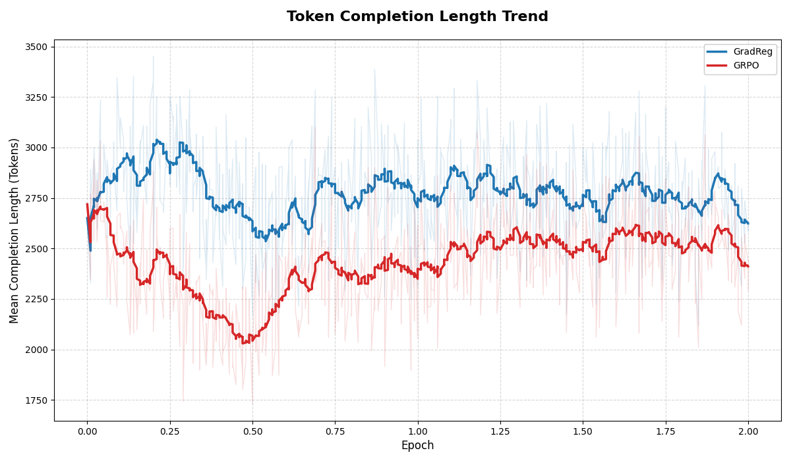

## Beginning Training
I wanted to approach the actual training part of this project in 2 steps. I am well aware that libraries such as trl exist for the sole purpose of optimizing every aspect of training runs. However, I felt like taking a hands-on approach would allow me to learn *even more* about what changes might be required to speed up training, and, more importantly, what *necessitates* these changes. For this reason, I opted to try running my training script bare-bones, built on just a custom PyTorch class; and then graduate to a custom instance of the trl GRPOTrainer class to hopefully smooth out all the wrinkles (inefficiencies) from my PyTorch implementation.

## PyTorch Implementation
I was **not** prepared for the rollercoaster that this first step alone would take me on. I chose Runpod as my Cloud provider of choice, and was quickly able to setup my environment and files + dataset for Qwen3-8B. That was, unfortunately, the extent of my smooth sailing experience. I was immediately hit with OOM galore - my *overly* optimistic initialization of group size=8, micro batch size=2, and max generation length=8192 was doomed from inception. It was like getting inspired by seeing somebody play DOOM on an ATM (no, really: https://www.youtube.com/watch?v=PW5ELKTivbE) and instead trying to run Warzone on it. I only wanted to fall to model quantization as a last resort, so I would be encouraged to learn what considerations are being implicitly handled in libraries like trl.

After much finicking, I finally was able to get through **1** whole step without an OOM error ! Sadly, it was all in vain, as the sacrifices I made to even get through 1 step posed several glaring red flags. Primarily, my group size had to drop to 2, with a max generation length of 2000. For the complex science questions I was training the model on, 2000 tokens barely scratched the surface for the amount of reasoning required by the model to produce a conclusive answer. I only observed truncated generations in the logs which seemed to validate my suspicion. Furthermore, a group size of 2 is only marginally better than PPO, in that it doesn't fully enable the model to explore the question space. Finally, I had to reduce my micro batch to 1, which doubled the computation time .. not exactly optimal. I realized after that I could have probably kept the group size the same in this setup, as the micro batches would accumulate, but that would take 4x longer..

Beyond hyperparameter tuning, I tried to take a few memory safety measures to stabilize my implementation further. I replaced my standard gradient pointer reassignment (using the `=` operator) with in-place copies (using `param.grad.copy_(current_grad)`) to reduce GPU memory fragmentation. Additionally, I implemented a memory cleaning routine by manually deleting generated rollouts and pre-perturbation gradients, along with explicit Python garbage collection and a CUDA cache flush to free up as much space as possible for the next training step. However, upon deeper inspection, I came to know that PyTorch actually handles all of this under the hood, and advises *against* manually calling `gc.collect() & empty_cache()`... so that was a bust.

While using in-place copies definitely helped, it was merely a drop in the ocean. I needed something a **lot** more aggressive to reduce my memory footprint & vRAM utilization. After looking around, I realized my AdamW optimizer was actually the one hogging all of the vRAM with it's use of 4 bytes for Momentum + Variance each; and since I was using mixed-precision training (to keep a copy of the FP32 master weights), another 4 bytes were used **per** parameter !

I knew that the reason optimizer states were stored in FP32 (and thus required so much memory) was because they accumulate tiny changes over millions of steps. If the Momentum were stored in 4-bit, it would very quickly lose the "memory" of previous steps - more precisely, the low-bit quantization would cause the resulting tiny values to underflow to 0. Thankfully, using an 8-bit optimizer like `torchao.optim.AdamW8bit` also only requires a fraction of the vRAM (compared to fp32), all while practically retaining the performance levels of 32-bit optimizer states( https://arxiv.org/pdf/2110.02861) ! If I were an LLM doing this write up, this is the point where I would bust out the phrase "smoking gun" haha.

The last bit of vRAM saving that I was able to eke out came from a slight throughput tradeoff - using activation checkpointing. This frees up a lot of the memory overhead that is accumulated by storing each intermediate activation during the forward pass, by simply throwing it away. These activations would then need to be re-computed during the backwards pass, which is where the performance tradeoff kicks in. For me, it was slightly more important to ensure thorough exploration through a larger group size, which is why I opted for it in the end.

## TRL Implementation
Having gone through all that, I finally decided to switch to a trl based implementation. This would also allow me to leverage vLLM during the rollout generation for it's *massive* boost to throughput via PagedAttention and the other kernel optimizations the library has under the hood. Thankfully, trl has an *extensive* args list, so I was even able to disable the scaled rewards as mentioned in the Dr. GRPO paper with a single parameter, rather than manually updating the compute_loss function.

This was, however, the point in the process where I made a pretty disastrous mistake. I monitored the logs for the first few steps, and confirmed that I wasn't facing any OOMs. Sleepy me decided this was good enough to leave running overnight while I caught some z's - crucially before I saw the initial logging metrics (which I had set to be every 10 steps). I woke up the next morning, pleasantly surprised and content with the fact that my run was still going and I hadn't faced any OOM errors overnight !

I was still under the impression that the training run went well, until I took a look into the training logs ... and much to my chagrin, I was faced with two catastrophic issues. My `grad_norm` was effectively zero, and my `frac_reward_zero_std` was an enormous 0.9 ! Furthermore, my `sampling/sampling_logp_difference/mean` value was non-zero, but it took me **way** longer to even find out why this was an issue, so more on this later.

The `frac_reward_zero_std` being so high, in my eyes, was part of the reason why my grad_norm was effectively zero. Since most of the responses had rewards with 0 standard deviation, the Advantage itself was directly impacted - as to compute the Adv, we subtract the mean of the group's rewards from each response's reward. Since 90% of the samples had the same reward, the mean would center around this value; and so subtracting this value from the reward would lead to a zeroing of the Advantage, and thus the entire loss function itself. Since the loss function has zeroed out, no gradients flow through, leading to a grad_norm of zero.

To combat this, I had to modify my reward function. Previously, I was using a simple 0, 0.5, 1.0 rubric setup, which, in retrospect, was obviously going to lead to issues with less dispersed rewards. I instead changed it to a range from 0.0 to 1.0, and added criteria with weighting - 0.5 for factual accuracy, 0.35 for conciseness, and 0.15 for formatting. Making this change saw my `frac_reward_zero_std` metric immediately plummet to 0. Also - for reference - I made use of gemini-2.5-flash-lite as the grader.

This change didn't make a dent on the `grad_norm`, unfortunately. I tried messing around with some of the hyperparameters directly controlling the gradient but to little avail. This revelation saw my slow descent into madness, as I struggled to pinpoint where in my perturbed loss calculation I was nuking my gradients. It wasn't until an embarrassingly long time later that I thought to do a quick sanity check - and try it with a regular GRPOTrainer instance instead. 

The result of my sanity check confused me even more, as the grad_norm **still** remained obstinately close to 0, which implied that my code (ostensibly) wasn't at fault... I had run out of things to point fingers at. The only fault I could conceive at this point was to do with vLLM - as I had opted to use it for it's massive boost to throughput. With my wallet bleeding bills, I ran a final test with vLLM disabled and prayed for something. Lo and behold, 25 minutes later (which is crazy in retrospect, the vLLM team cut this down to ~5 minutes) I see `'grad_norm': 0.75390625` in the metrics !

Having confirmed this, I immediately take to GitHub to see if any issues have been raised regarding this. In this one instance, I was beyond relieved in knowing my experience was not a unique one; and there existed some GitHub user facing a similar issue (https://github.com/huggingface/trl/issues/4159), wherein the logits returned by vLLM were not scaled when temperature != 1 (which is needed for GRPO to encourage exploration).

This lack of scaling gets further compounded in the next step - importance sampling - which is required when using vLLM in collocate mode (running the inference engine on the same GPUs where I am training). Because the vLLM engine can slightly lag behind the most recent policy (probably to prevent the constant communication overhead between steps), trl instead incorporates importance sampling to accommodate for this lag and adjust accordingly. 

The importance sampling term would be calculated using the new policy (after the gradient updates), and the old policy (the old/stale weights being used by the vLLM engine) - `pi_new / pi_old`. pi_new would be properly scaled as it is handled by trl, however, vLLM (as mentioned in the GitHub issue) does *not* scale the resulting pi_old logits when using a temperature value != 1, thus leading to the `sampling_logp_difference` exploding.

To reconcile this difference, I just pass in `vllm_importance_sampling_correction=False` to the generation configs. This removes the  importance sampling calculation of the vLLM/trl sync from the loss, however it causes it's own host of issues involving bias - as we're computing the loss of the new policy using log probabilities from the old policy. Seeing as how incorporating the logp temperature change would require making changes to the vLLM engine itself (as the fix suggested in the GitHub issue was not compatible with my trl+vllm versions), I opt to accept this slight bias, rationalizing that the model is synched frequently enough for the bias to not compound extraordinarily.

## Results & Future Steps
Following these changes, I was **finally** able to observe a stable logging metric ! Determined not to make the same (costly) mistake as last time, I watched the training process steadily over the next couple of hours. Once I was satisfied that I had covered all the possible scenarios I could think of, I left it to run over the next 48 hours. Overall, the entire process of training the GradReg implementation and the baseline GRPO + all of the intermediate troubleshooting took ~ 1.5 weeks, and ~800$ of compute on 2x H200-SXM's.

More importantly, I will use this opportunity to try to get a taste of mechanistic interpretability ! It's a field that has fascinated me for a while, and I think this is the perfect scenario for me to give it a whirl. I will be able to (hopefully) get a clearer understanding of what exactly has been updated in the underlying circuits, and also attempt to see if the original Gradient Regularization paper's claims of generalizability hold. 

This is probably easier said than done, but I find having a concrete objective when going into new fields allows you to focus your attention on specifics, rather than getting confused and lost by the breadth that the topic has to offer. In this scenario, I know what exactly I want to understand about the circuits, it's up to me to figure out how to extend the methodologies that I learn about to satiate my thirst for answers !

Now, onto the results - Gradient Regularization did not appear to harm the model's ability to learn, as both the reward and loss curves appeared to follow pretty much the same trend; and neither faced policy collapse as the entropy seemed stable for both runs. The only apparent distinction I could make is that the GradReg implmentation seemed to prefer longer output lengths during the start of the training; but they both seemed to peter out to similar lengths towards the end of the training run as shown below.

As for the actual results, the performance for all the models are shown below, averaged across 3 trials. All were done with the same generation configs - 20,000 max tokens and 0.0 temp, no sampling. Notably the GradReg trained model seems to outperform the rest, but not by much. 

### Benchmark Results
| Model         | Category     | Avg Accuracy   | Std Dev   | Trial 1   | Trial 2   | Trial 3   |
|:--------------|:-------------|:---------------|:----------|:----------|:----------|:----------|
| gradReg       | diamond_gpqa | 65.32%         | 1.05%     | 65.66%    | 66.16%    | 64.14%    |
| base          | diamond_gpqa | 64.31%         | 2.04%     | 64.65%    | 66.16%    | 62.12%    |
| grpo          | diamond_gpqa | 64.14%         | 2.02%     | 66.16%    | 64.14%    | 62.12%    |